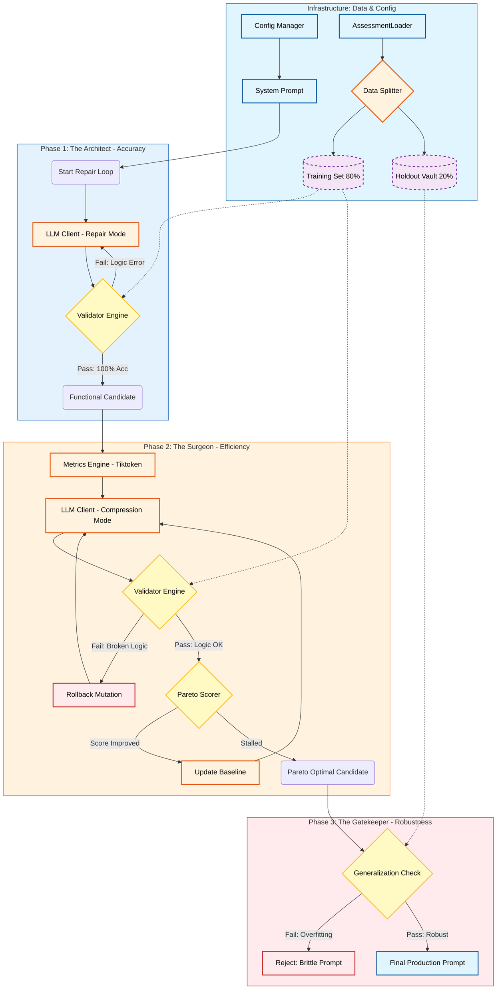

# xDevOps Prompt Optimizer

> A rugged, self-healing, and pareto-optimized engineering pipeline for LLM system prompts.

This project is an automated "refinery" for system prompts. It uses an evolutionary architecture to achieve two conflicting goals: **Functional Perfection** (100% accuracy on complex logic) and **Pareto Efficiency** (minimal token usage).

Unlike standard prompt engineering scripts, the GoPro Optimizer strictly separates the **Judge** (Validation) from the **Math** (Metrics) and the **Generator** (LLM), preventing hallucinated metrics and ensuring production-grade robustness.

## High-Level Architecture



    

The system operates in a dual-phase loop, guarded by a rigorous train/test split to prevent overfitting.

### Phase 1: The Accuracy Engine (The Architect)

- **Goal:** Fix logic errors and edge-case failures.
- **Method:** Iterative refinement using a "Repair" meta-prompt.
- **Constraint:** Token count is ignored; correctness is the only metric.
- **Exit Condition:** 100% Accuracy on the Training Set.

### Phase 2: The Shrink Ray (The Surgeon)

- **Goal:** Reduce input token count without breaking functionality.
- **Method:** "Hill Climbing" mutations using a "Compression" meta-prompt.
- **Constraint:** Any drop in accuracy triggers an immediate rollback.
- **Exit Condition:** No further efficiency gains possible (Pareto Optimal).

### The Gatekeeper: The Holdout Vault

- **Role:** The final exam.
- **Mechanism:** A 20% slice of the assessment data that the AI never sees during optimization.
- **Purpose:** Ensures the optimized prompt has learned general logic, not just memorized the test answers.

### Pareto Score Calculation

The system evaluates performance using a Pareto score that balances model accuracy against token consumption (a proxy for latency and cost).

$$ \text{Score} = (\text{Accuracy} \times \alpha) - (\text{Token Count} \times \beta) $$

Where:
*   **Accuracy**: The evaluated accuracy of the response (0.0 to 1.0).
*   **Token Count**: The precise BPE token count of the output.
*   **$\alpha$**: The weight assigned to accuracy (configured via `Config.ALPHA_ACCURACY`).
*   **$\beta$**: The penalty weight per token (configured via `Config.BETA_TOKEN_PENALTY`).


## System Components

### 1. The Core Infrastructure (The Chassis)
Manages the lifecycle of the optimization run.

- **Config Manager:** Loads environment variables (`.env`) and hyperparameters (e.g., `PATIENCE=3`, `ALPHA_WEIGHT=100`).
- **Async LLM Client:** A robust OpenAI v1 wrapper handling parallel requests, JSON-mode enforcement, and truncation errors (`finish_reason="length"`).

### 2. The Data Layer (The Fuel)
Responsible for feeding clean, unbiased data to the optimizer.

- **Assessment Loader:** Parses the raw `assessment.json`.
- **The Splitter Strategy:** Implements the logic to partition data:
    - **Training Set (80%):** Visible to the AI for optimization.
    - **Holdout Vault (20%):** Locked away for final validation.

### 3. The Validator Engine (The Ruthless Judge)
A deterministic Python engine that validates outputs. No AI involved here.

- **JSON Syntax Enforcer:** Ensures output is valid, parseable JSON.
- **Schema Compliance Checker:** Verifies required keys (`command`, `options`) exist.
- **Deep Semantic Comparator:** The "Discriminator" logic:
    - **Set-Logic:** Compares unordered lists (e.g., tags) as sets.
    - **Sequence-Logic:** Compares steps as strict ordered lists.
    - **Float Tolerance:** Matches numbers like 0.8 vs 0.80 accurately.

### 4. The Metrics Engine (The Math)
Responsible for quantitative measurement.

- **Local Tokenizer:** Uses `tiktoken` locally to count tokens with 100% precision (zero cost/latency). The LLM is never asked to count tokens.
- **Pareto Scorer:** Calculates the fitness score `F(p)` combining Accuracy (from the Judge) and Efficiency (from the Tokenizer).
- **Latency Tracker:** Measures wall-clock time execution.

### 5. The Prompt Generator (The Dual-Mode Brain)
Constructs the actual API calls to the Refiner LLM.

- **Context Injector:** Dynamically assembles the context: Current Prompt + Failure Summary (Expected vs. Actual diffs).
- **Dual-Mode Controller:** Selects the meta-strategy:
    - **Mode A (Architect):** "Fix logic errors. Add rules. Ignore length."
    - **Mode B (Surgeon):** "Prune text. Maintain logic. Optimize brevity."

### 6. The Orchestrator (The Controller Loop)
The "Main Loop" logic.

- **Rollback Mechanism:** The safety brake. If a mutation drops accuracy below 100%, it instantly reverts to the `previous_best` state.
- **Convergence Detector:** Monitors the `PATIENCE` counter to stop the process when gains stall.

## Installation

To set up the environment for this project, follow these steps:

1. **Create a virtual environment:**
   ```bash
   python3 -m venv .venv
   ```

2. **Activate the virtual environment:**
   - On macOS/Linux: `source .venv/bin/activate`
   - On Windows: `.venv\Scripts\activate`

3. **Install dependencies:**
   ```bash
   pip install -r requirements.txt
   ```

4. **Configure Environment Variables:**
   
   Create a `.env` file in the root directory with the following format:

   ```ini
   # OpenAI API Configuration
   OPENAI_API_KEY=sk-your-actual-api-key-here

   # File Paths (relative to project root)
   SYSTEM_PROMPT_FILE=system_prompt.json
   META_PROMPT_FILE=meta_prompt.txt
   META_PROMPT_EFFICIENCY=meta_prompt_efficiency.txt
   ASSESSMENT_FILE=assessment.json
   LLM_PROVIDER = openai              # LLM Provider


   # Model Selection
   MODEL_FAST=gpt-4o-mini              # Fast model for validation
   MODEL_SMART=gpt-4o                  # Smart model for optimization

   # Optimization Parameters
   ALPHA_ACCURACY=1000.0               # Weight for accuracy in scoring
   BETA_TOKEN_PENALTY=0.01             # Penalty per token
   PATIENCE=6                          # Iterations to wait without improvement
   ARCHITECT_PATIENCE = 12             # Iterations for polishing the prompt if if does not have 100% accuracy in the first phase
   SCORE_THRESHOLD=0.100                #Score difference from when we do not accept the optimized prompt

   # Temperature Settings
   TEMPERATURE_VALIDATOR=1           # Deterministic validation
   TEMPERATURE_ARCHITECT=1           # Low creativity for repairs
   TEMPERATURE_EFFICIENCY=1          # Moderate creativity for compression

   # Directory Paths
   LOGS_DIR=logs
   ASSETS_DIR=assets
   ```

   > **Warning:** Never commit your `.env` file with real API keys. Add it to `.gitignore`.

   > **Warning:** Recent reasoning openai models do not require temperature and by default it is not sent as a parameter.


## Usage

## The Input Contract (Required Files)

To use this optimizer for **YOUR** specific task (e.g., Python Coding, SQL Generation, Customer Support), you must provide **4 Input Files** in the `assets/` directory.

These files define the "Soul" of the application. The optimizer is just the engine.

### 1. `assets/system_prompt.json` (The Candidate)
This is your "Draft" system prompt. It must be a valid JSON file containing the text you want to optimize.

* **Format:** JSON
* **Required Structure:** A key (e.g., `system_prompt` or `instructions`) containing the text.
* **Example:**
    ```json
    {
      "title": "Milvus Router",
      "system_prompt": "You are a routing assistant. You must output JSON..."
    }
    ```

### 2. `assets/assessment.json` (The Exam)
This is your **Ground Truth**. The optimizer uses this to grade the prompt. It must be a list of test cases.

* **Format:** JSON List
* **Required Keys:**
    * `conversation`: A list of standard OpenAI message objects (`role`, `content`).
    * `expected_json`: The **exact** JSON string you want the model to produce. (Or `expected_text` if you modified the validator for text).
* **Example:**
    ```json
    [
      {
        "conversation": [{"role": "user", "content": "Find documents about 'AI'."}],
        "expected_json": "{\"command\": \"search\", \"query\": \"AI\"}"
      }
    ]
    ```

### 3. `assets/meta_prompt.txt` (The Teacher)
This text file tells the **Architect Agent** how to fix your prompt when it fails. This is where you define the "Persona" of the optimizer.

* **Format:** Plain Text
* **Content:** Instructions on how to analyze failures for your specific domain.
* **Example:**
    ```text
    MISSION: SYSTEM PROMPT REPAIR
    You are an expert Prompt Engineer.
    1. Analyze the 'Actual' vs 'Expected' output.
    2. If the model output invalid JSON, add formatting rules.
    3. If the model missed a keyword, add reasoning steps.
    4. Return ONLY the fixed System Prompt.
    ```
   

### 4. `assets/meta_prompt_efficiency.txt` (The Editor)
This text file tells the **Efficiency Expert** how to compress your prompt without breaking it.

* **Format:** Plain Text
* **Content:** Strategies for shortening text in your domain.
* **Example:**
    ```text
    MISSION: PROMPT COMPRESSION
    1. Remove conversational filler (e.g., "Please ensure you...").
    2. Merge redundant rules.
    3. Minify JSON examples.
    CRITICAL: Do not remove the "Output Format" section.
    ```
   

---

## Configuration (`config.py`)

You can tune the optimizer's behavior in `config.py` without changing code:

* **`ALPHA_ACCURACY` (Default: 100.0):** How much the system cares about correctness. Keep this high to ensure 100% accuracy is the priority.
* **`BETA_TOKEN_PENALTY` (Default: 0.01):** The "Tax" per token. Increase this to make the system more aggressive about cutting words (at the risk of breaking logic).
* **`PATIENCE`:** How many failed attempts (no token reduction) the Efficiency Expert gets before the system decides "This is as good as it gets" and stops.

---

##  Usage

Once your 4 files are in `assets/`, simply run:

```bash
cd src  
python main.py
```

The optimizer will:
1. Load the assessment data and split it into training/test sets
2. Run Phase 1 (Architect) to achieve 100% accuracy
3. Run Phase 2 (Efficiency Expert) to optimize token usage
4. Validate the final prompt against the holdout test set
5. Save the optimized prompt to the `optimized/` directory

## Project Structure

```text
.
├── .env                          # Environment variables (API keys, config) - DO NOT COMMIT
├── .gitignore                    # Git exclusion rules
├── README.md                     # Project documentation
├── requirements.txt              # Python dependencies
├── assets/                       # Input data and prompt templates
│   ├── assessment.json           # Ground truth test cases
│   ├── meta_prompt.txt           # Instructions for Phase 1 (Accuracy)
│   ├── meta_prompt_efficiency.txt # Instructions for Phase 2 (Efficiency)
│   └── system_prompt.json        # The initial system prompt to optimize
├── optimized/                    # Output directory for optimized prompts
│   └── system_prompt_optimized.json # Example optimized result
└── src/                          # Main source code
    ├── architect_check.py        # Test script for Architect logic
    ├── assessment_loader.py      # Data loading and train/test splitting
    ├── config.py                 # Configuration management
    ├── efficiency_check.py       # Test script for Efficiency Expert
    ├── harness_check.py          # Validation harness test script
    ├── llm_client.py             # Async OpenAI client wrapper
    ├── main.py                   # ** MAIN ENTRY POINT ** - Run this file
    ├── metrics.py                # Token counting and Pareto scoring
    ├── optimizer.py              # AI Agents (Architect & EfficiencyExpert)
    ├── score_check.py            # Scorer validation test script
    ├── templates.py              # Meta-prompt template loader
    └── validator.py              # Deterministic JSON validation engine
```

## Limitations

- Ambiguity: If your assessment.json is ambiguous (e.g., "Find tasks for Alice" could mean assigned_to OR created_by), the optimizer may loop indefinitely. Ensure your test data is distinct.

- Context Window: The Architect cannot optimize prompts that exceed the context window of the MODEL_SMART.

- Cost: Optimization is computationally expensive. Use a smaller PATIENCE value (e.g., 3) for initial runs.


## Core Philosophy & MVP Scope

This tool is designed for **deterministic engineering**, not creative writing. It is built specifically for **JSON System Prompts** used in:
* Semantic Routers (e.g., "Route to Milvus" vs. "Route to Web Search")
* RAG Gateways
* Tool Calling Agents

**It is NOT designed for:**
* Creative story writing prompts.
* Chatbots with open-ended personalities.
* Prompts that return unstructured text.
